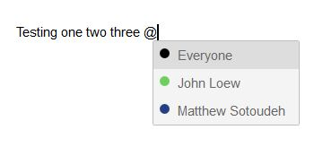
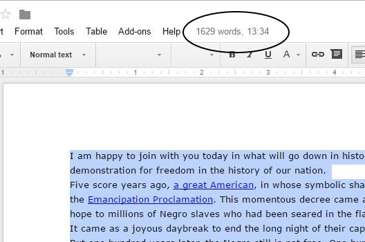
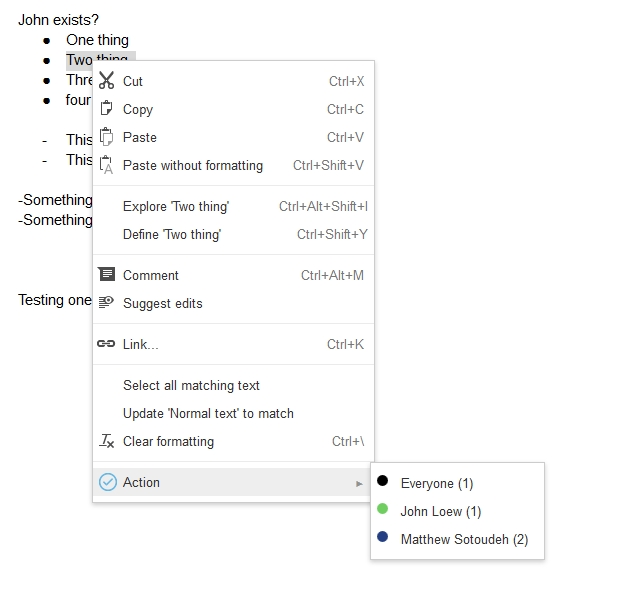

# docs-plus
A library for rich Google Docs extensions that can integrate with its editor.

[Skip to the Quickstart](#quickstart)

# History
Docs+ was originally built for [Action](https://meetaction.com/), an add-on that simplifies action item tracking during Google Docs meetings, about two years ago. Development on Action has sort of died down into a long-term support mode now, and I realized that (as far as I can tell) there isn't another good Docs-integration library, so I figured someone else might find use in this part of the Action code.

# License
All code in this repository (other than the files in the ``reference`` folder) is licensed under the MIT license.

If you're having trouble using any of the code (or doing anything with Docs, particularly something [Action](https://meetaction.com/) already does) feel free to reach out! I went through a lot of trial and error with Action and might be able to point you in the right direction.

# Demos/examples
- [Action](https://meetaction.com/) was the origin of Docs+. It allows users to easily add action items to a shared 'follow-up list' that gets sent to all attendees by email after the meeting. It is deeply integrated with the editor, and does a great job of showing off what Docs-integrated extensions are capable of.
- [Speechless](https://github.com/matthewsot/speechless) uses the Docs+ library to predict time-to-speak for a user's selected text. This could be useful, for example, when writing a time-limited speech or presentation.

# Screenshots
Docs+ allows you to interact with the user's text in the Google Docs Kix editor. A few screenshots of extensions using Docs+:

Rich interactions with the editor:



Adding custom buttons to Docs:


Using the user's selected text:



Interacting with Docs menus:



# Quickstart
First, include jQuery, docs.js, and utils.js in your project (ideally in that order). Then, start using the Docs+ library!

If you are using Docs+ as a Greasemonkey userscript, you may run into problems using text insertion functions. If so, please change the ``docs.platform`` value to ``"userscript"`` to solve these issues.

### Document information
You can access the document name and Drive ID like so:
```javascript
var docId = docs.id;
var docName = docs.name;
```

### Getting selected text
To get the user's currently selected text, use ``docs.getSelection``

```javascript
docs.getSelection(function (selection) {
    alert("You selected: " + selection);
});
```

If you'd like to default to returning the current text paragraph if there is no currently selected text, you can pass a parameter to the ``getSelection`` function:

```javascript
docs.getSelection(function (selection) {
    alert("You selected (or your insertion point is on): " + selection);
}, true);
```

If you run into issues with multi-line text (or text spanning across multiple bullet points), you can get the raw text selection element by passing a second 'true' parameter.

The following code calculates the time it would take to speak the currently selected text (see [speechless](https://github.com/matthewsot/speechless) for a full demo):

```javascript
docs.getSelection(function (textEl) {
    var text = "";
    $(textEl).children().each(function () {
        text = text.trim() + " " + $(this).text().trim();
    });
    text = text.trim().replace("\n", " ");

    var words = text.split(' ').length;
    var minutes = words / wordsPerMinute;
    var seconds = Math.round((minutes - Math.floor(minutes)) * 60);
    if (seconds.toString().length === 1) {
        seconds = "0" + seconds.toString();
    } else if (seconds.toString().length === 0) {
        seconds = "00";
    }

    var time = Math.floor(minutes) + ":" + seconds;

    $("#docs-notice").text(words + " words, " + time);
}, true, true);
```

### Inserting text
You can insert text at the current text insertion point using the ``docs.insertText(text)`` function.

```javascript
docs.insertText("Hello, World!");
```

### Other methods
There are numerous other methods in ``docs.js`` that you can use to interact with the editor:
* ``docs.getSelectionEl`` will return the raw selection highlight element from Docs
* ``docs.hasSelection`` will return whether the user has currently selected any text in Docs
* ``docs.backspace`` will delete the character directly before the user's insertion point
* ``docs.setColor`` will set the current text color. If I remember correctly, you should call it using ``docs.colors`` like so:
```javascript
docs.setColor($(docs.colors["gray"]));
```
* ``docs.toggleSubscript`` will toggle whether the text should be subscripted or not
* ``docs.getCurrentParagraphText(callback)`` will get the text of the paragraph which the user's insertion point is on
* ``docs.getUserCursor`` will return the raw element of the user's text insertion point

### Handling real-time editor input
``editor-input.js`` includes a number of helper functions to handle real-time editor input.

You can set up a handler for every time the user presses down a key in the editor:
```javascript
docs.keyboard.handleKeydown = function (e) {
    var chr = e.key; //"a", "b", etc.
}
```

Or, block mouse or keyboard inputs temporarily:
```javascript
docs.keyboard.startBlockingMouse();
docs.keyboard.startBlockingKeyboard();

docs.keyboard.stopBlockingMouse();
docs.keyboard.stopBlockingKeyboard();
```

This can be useful if when using in-text selectors that need to appear under the user's cursor, and you do not want to re-place those selectors when the user navigates to a different part of the document.

### Handling mouse events
There are currently no helpers for mouse events in Docs+, but you should hook into ``mouseup`` on ``.kix-appview-editor`` if you want to handle them. See the [speechless demo](https://github.com/matthewsot/speechless) for an example of this:

```javascript
$("body").on("mouseup", ".kix-appview-editor", function (e) {
    //Handle click
});
```

### Adding a "Docs Button"
Again, Docs+ currently does not provide helpers for adding a button the the Docs header (near "Comment" and "Share"), but here's some code to start with if you'd like to do that:

```javascript
$(".docs-titlebar-buttons").prepend(
    $("<div></div>", {"class": "custom-button"}).text("Custom Button"));
```

```css
.custom-button {
    z-index: 1;
    position: relative;
    float: left;
    padding: 0 15px;
    height: 29px;
    line-height: 29px;
    box-sizing: border-box;
    border-radius: 2px;
    background-color: #999;
    cursor: default;
}
```

# Other capabilities
There is a lot of integration code scattered throughout the Action extension codebase, and Docs+ really only includes the most common/basic/useful parts. If you are interested in code to do any of the below, please get in contact with me or file an issue on this repository and I'll see if I can pull the code into Docs+:

* Accessing the list of users shared on the current document (including emails and names)
* Right-click menus
* Tag watching (watch a certain block of text in the document for changes)
